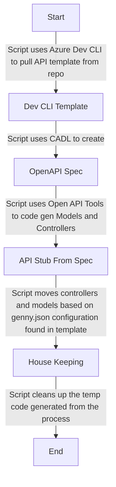

# Introduction 
This repo is used to illustrate a way to take a spec first approach to API development. It will pull a predefined application template, generate open api specs from the cadl file, and models and controllers from the resulting open api spec.

# Tools that are being used

## Cadl

https://microsoft.github.io/cadl/

Cadl is a language for describing cloud service APIs and generating other API description languages, client and service code, documentation, and other assets. Cadl provides highly extensible core language primitives that can describe API shapes common among REST, GraphQL, gRPC, and other protocols.

We're using cadl as the language for defining the specifications of the API. In our sample we have a spec that is based on the info controller created for testing Azure Container Apps deployment.

## Azure Developer CLI

https://learn.microsoft.com/en-us/azure/developer/azure-developer-cli/overview 

Azure Developer CLI (azd) is an open-source tool that accelerates the process of building cloud apps on Azure. The CLI provides best practice, developer-friendly commands that map to key stages in your workflow, whether you’re working in the terminal, your editor or integrated development environment (IDE), or DevOps.

We're using this tool in this solution to harness not just it's ability to pull down templates and get started fairly quickly from an existing template, but to also have the tools available to the developers for easier deployment into Azure.

More Azure Dev CLI Templates:

https://azure.github.io/awesome-azd/?source=october-release-blog-post&tags=aca 

## Open API Generator

https://openapi-generator.tech/

Used to Generate clients, servers, and documentation from OpenAPI 2.0/3.x documents. This is an open source fork of swagger gen. Either tool should be able to do the job. Another option is autorest. OpenAPI was chosen because of the ability to have a larger level of control over what is being output.

We're using this tool to generate the controllers and models defined by the cadl spec. There are a couple of hacky steps involved with using this tool. 

* The first being that we're not going straight from the cadl to the models and controllers. Instead we're first generating the open api spec (you'll find it within the /{ouput_dir}/specs folder when the script is complete).
* Second, as of the writing of this sample, openapi only has a single generator for a c# server. That is the "csharp-netcore-functions". This isn't a huge hurdle for us, as we can override the template used to generate function files to match an ASP.Net Web Controller instead. You'll find that overridden template in the /.openapi-generator/template directory of the Chomp template. We could do the same for the models, but the default template for them is already pretty close to what would be needed for the models already, and contains some pretty nice boilerplate bits out of the box.

# genny.sh script



Sample call...

./genny.sh -t https://gerardmaxwell@dev.azure.com/gerardmaxwell/APIDevelopment/_git/Chomp -b shawn/spec-first -s shgaul-devtest

## Script options

```
<The command will allow you to use a spec first approach to developing APIs>

Command
    genny.sh : Will clone from a source template library and generate the models and controllers based on the cadl specs defined.

Arguments
    --template, -t        The template to use when you initialize the project.
    --branch, -b          The template branch to initialize from. [default: main]
    --location, -l        Azure location for the new environment. [default: westus3]
    --environment, -e     The name of the environment to use. [default: dev]
    --subscription, s     Name or ID of an Azure subscription to use for the new environment
    --output-dir, -o      The dirctory to generate the API in [default: ./modules]
    --cadl-file, -c       Path to the cadl file to generate from [default: main.cadl]
    --spec-version, -v    Spec version to generate files for [default: v1]
```

## genny.json configuration options

The template directory contains the configuration bits that are specific to the that templates generation demands. A sample of the json configuration is:

```json
{
    "packageName": "WebApi",
    "generatorName": "csharp-netcore-functions",
    "templatePath": "/.openapi-generator/template",
    "movables": [
        {
            "from": "/src/WebApi/Functions",
            "to": "/src/services/WebApi/WebApi/Controllers"
        },
        {
            "from": "/src/WebApi/Models",
            "to": "/src/services/WebApi/WebApi/Models"
        }
    ]
}
```

Definitions:

* packageName: Used by the csharp-netcore-functions OpenAPI Generator within the template. Will effect the name of the directories being generated and the namespace defined within the controllers and models
* generatorName: The name of the generator OpenAPI Generator will use
* templatePath: The path to the template overrides for this package
* movables: Defines which directories of files that are generated, need to be moved into the resulting code (the sample shows both the controllers and the models configuration)
    * from: Directory to copy from (notice in the sample, the package name vaue is contained in the from values)
    * to: Directory to copy the files to (again notice the package names reference again)

# Script Prerequisites

https://stedolan.github.io/jq/

https://microsoft.github.io/cadl/introduction/installation

https://learn.microsoft.com/en-us/azure/developer/azure-developer-cli/install-azd 

https://nodejs.org/en/knowledge/getting-started/npm/what-is-npm/
